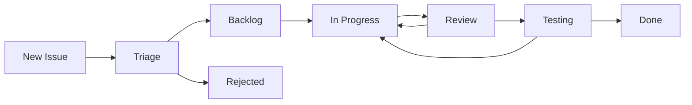

# LazySSH Project Management Guide

This document outlines the project management structure, processes, and best practices for the LazySSH project.

## 📋 Table of Contents

- [Project Structure](#project-structure)
- [Issue Management](#issue-management)
- [Project Boards](#project-boards)
- [Release Planning](#release-planning)
- [Development Workflow](#development-workflow)
- [Quality Assurance](#quality-assurance)
- [Communication](#communication)

## 🏗️ Project Structure

### Project Hierarchy

```
LazySSH Project
├── 🎯 Epics (Large initiatives, 1-3 months)
├── 📋 Features (Individual features, 1-4 weeks)
├── 🐛 Bugs (Issues to fix, 1-5 days)
├── 📚 Documentation (Content updates, 1-3 days)
└── 🔧 Maintenance (Technical debt, 1-7 days)
```

### Issue Types

| Type | Label | Description | Typical Duration |
|------|-------|-------------|------------------|
| Epic | `epic` | Large feature or initiative | 1-3 months |
| Feature | `enhancement` | New functionality | 1-4 weeks |
| Bug | `bug` | Something that's broken | 1-5 days |
| Documentation | `documentation` | Content updates | 1-3 days |
| Maintenance | `maintenance` | Technical debt, refactoring | 1-7 days |

## 🎯 Issue Management

### Issue Labels

#### Priority Labels
- `high-priority` - Critical issues that block releases or core functionality
- `medium-priority` - Important issues that should be addressed soon
- `low-priority` - Nice-to-have issues that can be deferred

#### Component Labels
- `scp-mode` - Issues related to SCP file transfer functionality
- `connection-management` - SSH connection handling
- `ui-ux` - User interface and experience
- `performance` - Performance optimization
- `security` - Security-related issues
- `testing` - Testing infrastructure and test cases
- `documentation` - Documentation updates

#### Status Labels
- `needs-triage` - New issues that need initial review
- `in-progress` - Issues currently being worked on
- `blocked` - Issues waiting for dependencies
- `ready-for-review` - Issues ready for code review
- `ready-for-testing` - Issues ready for QA testing

#### Special Labels
- `good-first-issue` - Suitable for new contributors
- `help-wanted` - Community contributions welcome
- `breaking-change` - Changes that break backward compatibility
- `v2.0` - Issues planned for version 2.0

### Issue Templates

We provide structured templates for different issue types:

- **Epic Template** (`.github/ISSUE_TEMPLATE/epic.md`)
- **Feature Request** (`.github/ISSUE_TEMPLATE/feature.md`)
- **Bug Report** (`.github/ISSUE_TEMPLATE/bug_report.md`)

### Issue Lifecycle



1. **New Issue**: Issue is created using template
2. **Triage**: Maintainers review and label the issue
3. **Backlog**: Issue is prioritized and added to backlog
4. **In Progress**: Developer starts working on the issue
5. **Review**: Code review process
6. **Testing**: QA testing and validation
7. **Done**: Issue is completed and closed

## 📊 Project Boards

### Main Project Board: "LazySSH Development"

**Columns:**
1. **📥 Backlog** - Triaged issues ready for development
2. **🔄 In Progress** - Issues currently being worked on
3. **👀 Review** - Issues in code review
4. **🧪 Testing** - Issues in QA testing
5. **✅ Done** - Completed issues

### Epic Tracking Board: "LazySSH v2.0 Roadmap"

**Columns:**
1. **📋 Planning** - Epics in planning phase
2. **🚀 Active** - Epics currently in development
3. **🔍 Review** - Epics in review/testing
4. **✅ Complete** - Completed epics

### Release Board: "Release Planning"

**Columns:**
1. **🎯 Next Release** - Issues planned for next release
2. **🔮 Future Releases** - Issues for future releases
3. **❄️ Icebox** - Issues on hold or deferred

## 🚀 Release Planning

### Release Cycle

LazySSH follows a **time-based release cycle** with the following schedule:

- **Major Releases** (x.0.0): Every 6-12 months
- **Minor Releases** (x.y.0): Every 1-2 months
- **Patch Releases** (x.y.z): As needed for critical bugs

### Version Numbering

We follow [Semantic Versioning](https://semver.org/):

- **MAJOR** version for incompatible API changes
- **MINOR** version for backward-compatible functionality additions
- **PATCH** version for backward-compatible bug fixes

### Release Process

1. **Planning Phase** (2 weeks before release)
   - Review roadmap and prioritize features
   - Create release milestone
   - Assign issues to milestone

2. **Development Phase** (4-6 weeks)
   - Active development on planned features
   - Regular progress reviews
   - Continuous integration and testing

3. **Stabilization Phase** (1 week)
   - Feature freeze
   - Bug fixes only
   - Documentation updates
   - Release candidate testing

4. **Release Phase** (1 day)
   - Final testing
   - Release notes preparation
   - Version tagging and publishing
   - Announcement

### Release Criteria

**Major Release (v2.0)**
- [ ] All high-priority epics completed
- [ ] Performance targets met
- [ ] Security audit passed
- [ ] Documentation complete
- [ ] Migration guide available

**Minor Release (v1.x)**
- [ ] All planned features implemented
- [ ] No critical bugs
- [ ] Documentation updated
- [ ] Backward compatibility maintained

**Patch Release (v1.x.y)**
- [ ] Critical bugs fixed
- [ ] No new features
- [ ] Minimal risk changes only

## 🔄 Development Workflow

### Git Workflow

We use **GitHub Flow** with the following branches:

- `main` - Production-ready code
- `feature/issue-number-description` - Feature development
- `bugfix/issue-number-description` - Bug fixes
- `hotfix/issue-number-description` - Critical production fixes

### Pull Request Process

1. **Create Branch** from `main`
2. **Develop Feature** with regular commits
3. **Create Pull Request** with description
4. **Code Review** by maintainers
5. **Address Feedback** if needed
6. **Merge** after approval and CI passes

### Code Review Guidelines

**Reviewers should check:**
- [ ] Code quality and style
- [ ] Test coverage
- [ ] Documentation updates
- [ ] Performance impact
- [ ] Security considerations
- [ ] Backward compatibility

**Authors should ensure:**
- [ ] Clear commit messages
- [ ] Comprehensive tests
- [ ] Updated documentation
- [ ] No breaking changes (unless planned)
- [ ] CI pipeline passes

## 🧪 Quality Assurance

### Testing Strategy

**Automated Testing:**
- Unit tests (90%+ coverage target)
- Integration tests
- Performance benchmarks
- Security scans

**Manual Testing:**
- User acceptance testing
- Cross-platform testing
- Edge case validation
- Usability testing

### Quality Gates

**Pre-merge Requirements:**
- [ ] All tests pass
- [ ] Code coverage maintained
- [ ] No security vulnerabilities
- [ ] Documentation updated
- [ ] Code review approved

**Pre-release Requirements:**
- [ ] Full test suite passes
- [ ] Performance benchmarks met
- [ ] Security audit clean
- [ ] Documentation complete
- [ ] User acceptance testing passed

## 💬 Communication

### Regular Meetings

**Weekly Standup** (Async via GitHub)
- Progress updates on assigned issues
- Blockers and dependencies
- Upcoming work plans

**Monthly Planning** (GitHub Discussions)
- Roadmap review and updates
- Priority adjustments
- Resource allocation

**Quarterly Reviews** (GitHub Issues)
- Epic progress assessment
- Performance metrics review
- Strategic planning updates

### Communication Channels

- **GitHub Issues** - Feature requests, bug reports, discussions
- **GitHub Discussions** - General project discussions
- **Pull Requests** - Code review and technical discussions
- **Release Notes** - User-facing updates and changes

### Documentation

**Maintained Documentation:**
- User guides and tutorials
- API reference
- Architecture documentation
- Contributing guidelines
- Project management processes

**Documentation Standards:**
- Clear, concise writing
- Regular updates with releases
- Community contribution friendly
- Multi-format support (web, PDF)

## 📈 Metrics and KPIs

### Development Metrics

- **Velocity**: Issues completed per sprint
- **Lead Time**: Time from issue creation to completion
- **Cycle Time**: Time from development start to completion
- **Bug Rate**: Bugs per release
- **Test Coverage**: Percentage of code covered by tests

### Quality Metrics

- **User Satisfaction**: GitHub stars, user feedback
- **Performance**: Benchmark results, response times
- **Reliability**: Uptime, error rates
- **Security**: Vulnerability count, time to fix

### Project Health

- **Issue Backlog**: Number of open issues
- **PR Merge Time**: Average time to merge PRs
- **Contributor Activity**: Number of active contributors
- **Documentation Coverage**: Percentage of features documented

## 🎯 Best Practices

### For Contributors

1. **Start Small** - Begin with good-first-issue labeled items
2. **Follow Templates** - Use provided issue and PR templates
3. **Test Thoroughly** - Include comprehensive tests
4. **Document Changes** - Update relevant documentation
5. **Communicate Early** - Discuss approach before large changes

### For Maintainers

1. **Triage Regularly** - Review new issues weekly
2. **Provide Feedback** - Give constructive, timely feedback
3. **Maintain Quality** - Enforce quality gates consistently
4. **Support Community** - Help new contributors succeed
5. **Plan Ahead** - Maintain clear roadmap and priorities

### For Users

1. **Report Issues** - Use bug report template for problems
2. **Request Features** - Use feature request template
3. **Provide Context** - Include environment and reproduction steps
4. **Be Patient** - Allow time for proper investigation and fixes
5. **Contribute Back** - Consider contributing improvements

---

This project management guide is a living document that evolves with the project. For questions or suggestions, please open an issue or start a discussion. 